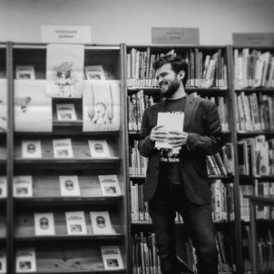
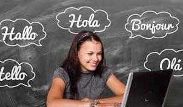
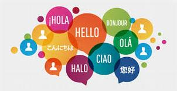

# ¿Quién soy?

[Servicios](servicios.md)

¡Hola! Soy H. Alejandro Arzayus García, tengo 33 años. Absoluto apasionado de los idiomas, además me gusta compartir mis conocimientos de forma didáctica y divertida. Tengo estudios universitarios y de postgrado en turismo, lenguas extranjeras y didáctica de las lenguas. Hablo inglés, francés e italiano y tengo más de 3 años de experiencia tabajando como docente de diferentes perfiles: niños, adolescentes y adultos, todo esto con muy buenos resultados. Lo que se traduce en programas de inmersión lingüistica, campamentos de verano, educación pública, clases particulares, academias y preparación para certificaciones en distintos niveles.  

## Programa de aprendizaje de idiomas on-line  

  

### Aprende inglés, francés o italiano sin salir de casa  

Mediante los cursos virtuales tendrás la oportunidad de aprender y practicar tu idioma favorito a la hora que mejor se adapte a tus actividades diarias, ¡sin salir de casa y con flexibilidad de horarios!  

  

### ¡Practica divirtiéndote!  

Mi enfoque es totalmente comunicativo. Olvídate de las soporíferas clases de solo gramatica. Con estos cursos a la carta trabajaremos las 4 competencias de forma divertida, a través de juegos, documentos reales y adaptados a tus necesidades. y a tu estilo propio de aprendizaje.

## Servicios:  

- Clases particulares de refuerzo*  
- Preparación de pruebas certificactivas*  
- Clases de conversación*  
- Traducciones para empresas de todo tipo de documentos: Tecnicos, divulgativos, informativos, literarios.  

*Todas las formulas pueden ser  presenciales o por skype.

## Competencias y logros:  

- Enfoque comunicativo  
- Desarrollo de programaciones y unidades didácticas  
- Manejo de recursos tecnológicos para la docencia : Edmodo, google classroom, Vocaroo, Pixton, Menti, Podomatic, Etwinning, kahoot, etc.  
- Preparación de actividades extraescolares de inmersión lingüística y campamentos de verano.  
- Preparación de talleres de escritura creativa para niños.  

## Mis publicaciones:

### Literatura:  

Mis libros: 

- La catarsis de un bufón sin nombre (Editorial Seleer, 2013)

- Poemas para Warta y el súbito despertar del tiempo (Mystica, 2016)

Plaquettes: 

- Ellas (2018)
                  
- Desnudándonos del polvo (2019)

Colaboraciones:

- Oviedo libro abierto (Ediciones Trea, 2017)
                            
- Primavera eterna (Minimal, 2015)

- Miradas de artistas (Planetario de Pamplona, 2019)

### Publicaciones academicas:

- L’effet de l’enseignement des stratégies d’écoute sur les apprenants de niveau débutant en utilisant des matériels multimédia authentiques. UPNA, 2018. Sous la direction de: Hanne Roothooft.

- Los retos del turismo ante el cambio climático: movilidad y crisis energética. Universidad de Oviedo, 2010. Bajo la dirección de : José Manuel Pérez.

## Contacto

alejandro.arzayus@gmail.com

